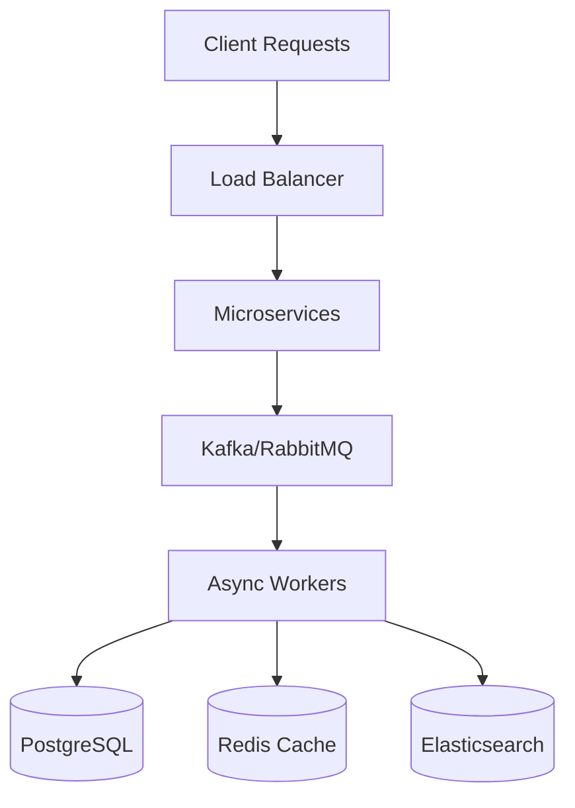

# Hi, I'm Shubham Kumar 👋

<div align="center">

### Senior Backend Engineer • Distributed Systems • Scalable Infrastructure • Real-Time Platforms


</div>

---

## 🚀 About Me

```yaml
name: Shubham Kumar
role: Senior Backend Engineer
experience: 4+ Years
specialization:
  - Distributed Systems
  - Event-Driven Architectures
  - High Performance Backend Systems
  - Scalable Infrastructure
  - Real-Time Streaming Systems

currently_building:
  - Real-time distributed platforms
  - AI-ready backend systems
  - Fault-tolerant microservices
  - Scalable async pipelines

interests:
  - System Design
  - Low Latency Systems
  - Backend Optimization
  - Distributed Computing
  - Cybersecurity
```

---

## ⚡ Tech Stack

<div align="center">

### Languages


### Backend & Distributed Systems


### Cloud & Infrastructure


</div>

---

# 🧠 Engineering Focus

<div align="center">

| Distributed Systems  | Performance Engineering | Reliability       |
| -------------------- | ----------------------- | ----------------- |
| Event-Driven Systems | Async Processing        | Fault Tolerance   |
| Real-Time Streaming  | Horizontal Scalability  | Observability     |
| Microservices        | Low Latency Systems     | High Availability |

</div>

---

## 🔥 Highlighted Engineering Work

### 📈 Real-Time Feed Ranking System

* Architected and scaled a personalized feed ranking system serving **50K+ DAU**
* Improved user engagement by **30%** using embedding-based clustering
* Built high-frequency feed update pipelines with low-latency processing

### ⚡ Distributed Leaderboard Infrastructure

* Designed a distributed leaderboard system processing **25K+ events/sec**
* Maintained **sub-100ms latency** under heavy concurrency
* Ensured consistency across distributed services

### 🎥 Distributed Video Processing Platform

* Built scalable video ingestion and transcoding pipelines
* Implemented chunk-based FFmpeg processing with HLS/DASH streaming
* Designed queue-driven worker architecture for parallel processing

### 🛡️ Mirai Botnet Reverse Engineering

* Reverse-engineered Mirai malware behavior and C2 mechanisms
* Simulated DDoS attack patterns across **100+ nodes**
* Published security research in IEEE and Springer publications

---

## 📊 GitHub Stats

<div align="center">


</div>

<div align="center">


</div>

---

## 🏗️ Systems I Love Building

```text
✔ High Throughput APIs
✔ Distributed Event Streaming Systems
✔ Real-Time Data Pipelines
✔ Async Worker Architectures
✔ Scalable Microservices
✔ Queue-Based Processing Systems
✔ Fault-Tolerant Infrastructure
✔ AI-Ready Backend Platforms
✔ Observability & Monitoring Systems
✔ Low Latency Backend Systems
```

---

## 🧩 Core Backend Concepts

<div align="center">



</div>

---

## 🏆 Achievements

* 📚 Published **3 Research Papers** in IEEE & Springer
* 🧠 Participated in **100+ CTF Competitions**
* ⚙️ Built prototypes in **10+ Hackathons**
* 🚀 Improved backend throughput by **2x** using async architectures
* 📉 Reduced production incidents by **25%** using observability practices
* 🔥 Reduced OS image size by **72%** improving deployment efficiency

---

## 🌐 Connect With Me

<div align="center">

[](https://linkedin.com/in/sshubhamk1)
[](mailto:sshubhamk1@hotmail.com)

</div>

---

<div align="center">

### 💡 "Build systems that scale before traffic arrives."


</div>
